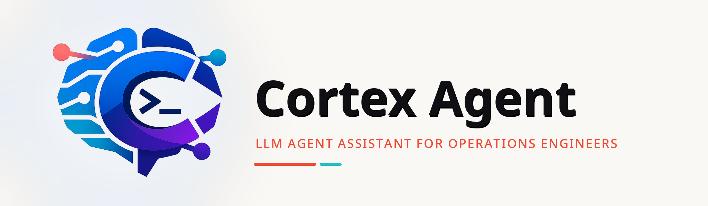

# Cortex Agent — LLM Agent Assistant for Operations Engineers

Cortex Agent is a lightweight, self-built, pure-Python LLM agent framework. It runs directly on your Linux server or local workstation, collaborates with large language models via the command line, and turns natural language into real command execution.

**Current focus: Operations / SRE / System Administration.** Other consumer-facing scenarios (browser automation, desktop file management, etc.) are not yet implemented and will be expanded gradually.

---

## Why Choose It?

There are many agents on the market, but Cortex Agent has a clear positioning: **be a truly usable "ops copilot" on a server**, rather than another opaque black-box full-automation system.

| Feature | Description |
|------|------|
| **Native server execution** | No Docker dependency, no browser extension needed. Just SSH into the server and run `python main.py` to start working. |
| **Real command execution** | It can invoke `run_shell` to execute system commands, read logs, install software, restart services, and modify configurations. |
| **Fully transparent and controllable** | Every command is echoed to the terminal, and sensitive / dangerous commands require your confirmation before execution. |
| **Self-built core loop** | ReAct reasoning loop, context compression, task delegation, permission approval, and other core mechanisms are fully self-implemented and easy to customize. |
| **Lightweight and dependency-free** | Pure Python, no additional daemon processes, databases, or message queues needed. Start and run immediately. |
| **SubAgent collaboration** | Complex tasks can be split into multiple asynchronous SubAgents running in parallel, with the Lead Agent planning and aggregating results. |

> **Who is it for?** Operations / Development / SRE personnel familiar with the Linux command line. If you need a "browser automation assistant" or a "chat-style UI", this project is not currently for you.

---

## What Can It Help You Do? (Operations Scenarios)

Cortex Agent excels at operations tasks that require **"check system status → analyze → execute commands → verify results"**:

- **Log troubleshooting**: Check `/var/log/` for errors in the last 30 minutes and summarize the cause.
- **Service diagnosis**: Nginx returns 502. Inspect processes, ports, configuration, and upstream status.
- **System inspection**: List disk, memory, CPU, zombie processes, and generate a Markdown report.
- **Environment setup**: Install Python packages, system tools, and configure crontab on the server.
- **Batch operations**: Execute the same set of commands on multiple machines and aggregate output.
- **Configuration changes**: Edit `nginx.conf`, `systemd` service files, and reload to verify.

Because these operations run directly on the server, the Agent can call real operations tools such as `systemctl`, `docker`, `kubectl`, `ss`, `netstat`, and `journalctl`, rather than simulating clicks through a browser.

---

## Core Design: Visible and Controllable

### 1. Command Transparency
Every command executed by the Agent is echoed to the terminal, so you can see what it is doing. If you feel the Agent is deviating from your intent, you can interrupt it at any time with `/interrupt` or `/stop` and interact with it.

### 2. Permission Levels
The `run_shell` tool has built-in command classification:

- **Whitelist**: View-only commands such as `ls`, `grep`, `cat`, `ps`, `systemctl status`, and `journalctl` are executed directly.
- **Sensitive commands**: Commands such as `wget`, `pip`, `npm`, `kill`, and `docker run` prompt you for `y/N` confirmation.
- **Dangerous commands**: Commands such as `sudo`, `shutdown`, `mkfs`, `rm -rf /`, and `systemctl restart` show a clear warning and require double confirmation.

> High-risk file operations (`rm` / `mv` / `chmod`, etc.) are also restricted to the `WORKDIR` scope to prevent accidental deletion of system paths.

### 3. SubAgent Dangerous Operations Require Lead Approval
When an asynchronous SubAgent reaches a dangerous command, it does not confirm directly. Instead, it sends the request to the Lead Agent, which aggregates all such requests and asks you once. This supports parallelism while avoiding permission pop-ups from multiple subtasks individually.

### 4. Fully Self-Controlled ReAct Core
All core logic lives in `src/agents/` and `src/infrastructure/`, with no dependency on third-party agent frameworks. You can:
- Modify system prompts to change Agent behavior;
- Adjust tool JSON schemas to add new tools;
- Rewrite the command classification list to match enterprise security policies;
- Customize context compression strategies for long log analysis scenarios.

---

## Quick Start

### 1. Environment Requirements

- **Python 3.10+** (the code uses extensive Python 3.10 type annotation syntax, such as `dict | None`)
- Any OpenAI-compatible LLM service (cloud or local)
- Recommended environments: Linux / macOS / WSL; some interactive command features are limited on Windows

Required third-party packages (no `requirements.txt` yet, please install manually):

```bash
pip install openai tiktoken transformers openpyxl xlrd pyyaml
```

> If you don't need the local tokenizer, you can install only `openai`, `tiktoken`, and `pyyaml`. Excel-related features require `openpyxl` / `xlrd`.

### 2. Configure LLM

Copy the example configuration file and fill it in:

```bash
cp .env.example .env
```

Edit `.env`:

```bash
# Third-party API example (Moonshot / OpenAI / DeepSeek)
LLM_BASE_URL=https://api.moonshot.cn/v1
LLM_API_KEY=your_api_key_here
LLM_MODEL=kimi-for-coding

# Local deployment example (vLLM / Ollama / xinference)
# LLM_BASE_URL=http://localhost:8000/v1
# LLM_MODEL=Qwen/Qwen3-32B
# TOKENIZER_PATH=/path/to/local/tokenizer
```

> Environment variable priority: `LLM_*` > legacy `KIMI_*` > `config/config.py` defaults. You can also inject them directly via `export`.

### 3. Start

```bash
python main.py
```

If critical configuration is missing, the program will print a clear message and exit.

### 4. Terminal Interaction Commands

After starting, you can enter natural language directly to let the Agent work, or use the following commands:

| Command | Function |
|------|------|
| `/inbox` | View and process Lead Agent inbox messages (SubAgent completions, permission requests, etc.) |
| `/task_list` | List all tasks and their statuses |
| `/manual_compact` | Manually trigger context compression |
| `/interrupt` / `/stop` | Interrupt the current Agent loop and provide new input |
| `q` / `exit` | Exit the program |

### 5. A Simple Example

```text
> Help me check current disk usage and find the top 5 directories by usage

(Agent invokes run_shell to execute df/du and returns the aggregated result)
```

```text
> Help me check whether nginx is running, and start it if not

(Agent invokes systemctl status nginx; if not running, it prompts for confirmation before starting)
```

---

## Safety and Notes

1. **Working directory sandbox**: File read/write operations are restricted to `WORKDIR` (default project root directory) to avoid accidental modification of system files.
2. **Dangerous commands**: Dangerous / sensitive commands ask the user for confirmation. SubAgent dangerous commands are aggregated by the Lead Agent before unified confirmation.
3. **Background tasks**: Commands that time out are promoted to background threads to continue execution, and the results are notified via MessageBus when finished. Note that this may leave long-running child processes.
4. **Production environment**: It is recommended to try it first on a test server or in an isolated container environment, and become familiar with the command classification strategy before using it in production.

---

## Current Status and Roadmap

### Implemented
- ReAct-based Lead Agent main loop
- Asynchronous SubAgent delegation and result aggregation
- Command-line interaction and permission control
- Context compression and loop detection
- Task management (Task Store) and dependency relationships
- File / Excel read/write tools

### Not Yet Supported (Planned)
- Web UI / Desktop GUI
- Browser automation (Selenium / Playwright)
- Non-technical user scenarios such as file management and office assistant
- Richer prebuilt skill packages (Skills)

If you want it to excel at a new operations sub-scenario, feel free to expand tools and prompts via Issue or PR.

---

## Logs

Each Agent writes logs independently without interfering with each other:

- **Lead Agent**: `logs/lead_agent/lead_{timestamp}.log`
- **SubAgent**: `logs/subagents/{subagent_id}_{timestamp}.log`

---

## Contributing and Feedback

Cortex Agent is still iterating rapidly. If you:
- Have run interesting real-world operations cases;
- Find the dangerous command classification strategy unreasonable;
- Want to add tools or prompts for a specific scenario;

Welcome to help make it an "Agent that operations personnel truly dare to use" through Issue or Pull Request.

---

---

# Cortex Agent — 面向运维工程师的 LLM 智能体助手

Cortex Agent 是一款轻量级、纯自研、基于Python的 LLM 智能体框架。它直接运行在你的 Linux 服务器或本地工作站上，通过命令行与大模型协作，把“说人话”转化为“执行真实命令”。

**当前主攻场景：运维 / SRE / 系统管理。**  其他面向普通用户的场景（浏览器操作、桌面文件管理等）尚未实现，后续会逐步扩展。

---

## 为什么选它？

市场上智能体很多，但 Cortex Agent 的定位很明确：**做一台服务器上真正可用的“运维副手”**，而不是一个又黑又大的全自动化黑盒。

| 特性 | 说明 |
|------|------|
| **原生服务器运行** | 不依赖 Docker、不依赖浏览器插件，直接 SSH 到服务器上 `python main.py` 即可开始工作。 |
| **真实命令执行** | 它能调用 `run_shell` 执行系统命令、读取日志、安装软件、重启服务、修改配置。 |
| **全程透明可控** | 每条命令都会显示给你，敏感 / 危险命令必须得到你确认才会执行。 |
| **自研核心循环** | ReAct 推理循环、上下文压缩、任务委托、权限审批等核心机制完全自主实现，便于定制。 |
| **轻量无依赖** | 纯 Python，无需额外守护进程、数据库或消息队列，启动即跑。 |
| **SubAgent 协作** | 复杂任务可拆分为多个异步 SubAgent 并行执行，Lead Agent 统一规划并汇总结果。 |

> **适合谁用？** 熟悉 Linux 命令行的运维 / 开发 / SRE 人员。如果你需要的是一个“浏览器自动化助手”或“聊天式 UI”，目前这个项目还不适合你。

---

## 它能帮你做什么？（运维场景示例）

Cortex Agent 最擅长处理需要**“查看系统状态 → 分析 → 执行命令 → 验证结果”**的运维任务：

- **日志排查**：帮我查看 `/var/log/` 下最近 30 分钟报错，并总结原因。
- **服务诊断**：Nginx 502 了，检查进程、端口、配置、 upstream 状态。
- **系统巡检**：列出磁盘、内存、CPU、僵尸进程，并生成 Markdown 报告。
- **环境安装**：在服务器上安装 Python 包、系统工具、配置 crontab。
- **批量操作**：对多台机器执行同一组命令，汇总输出。
- **配置修改**：帮我编辑 `nginx.conf`、`systemd` 服务文件，并 reload 验证。

因为这些操作直接运行在服务器上，Agent 可以调用 `systemctl`、`docker`、`kubectl`、`ss`、`netstat`、`journalctl` 等真正的运维工具，而不是隔着浏览器模拟点击。

---

## 核心设计：看得见、管得住

### 1. 命令透明
Agent 的每次命令执行都会回显到终端，你可以看到它要做什么。如果你认为Agent偏离了你的思路，你随时可以用 `/interrupt` 或 `/stop` 叫停，并和它交互。

### 2. 权限分级
`run_shell` 工具内置命令分级：

- **白名单**：`ls`、`grep`、`cat`、`ps`、`systemctl status`、`journalctl` 等查看类命令直接执行。
- **敏感命令**：`wget`、`pip`、`npm`、`kill`、`docker run` 等会提示你确认 `y/N`。
- **危险命令**：`sudo`、`shutdown`、`mkfs`、`rm -rf /`、`systemctl restart` 等会明确警告并要求二次确认。

> 高风险文件操作（`rm` / `mv` / `chmod` 等）还被限制在工作目录 `WORKDIR` 范围内，防止误删系统路径。

### 3. SubAgent 危险操作需要 Lead 审批
当异步 SubAgent 执行到危险命令时，不会直接确认，而是把请求发给 Lead Agent，由 Lead 汇总后统一询问你。这样既支持并行，又避免多个子任务各自弹权限确认。

### 4. 自主可控的 ReAct 核心
所有核心逻辑都在 `src/agents/` 和 `src/infrastructure/` 中，不依赖第三方 Agent 框架。你可以：
- 修改 system prompt 改变 Agent 行为；
- 调整工具 JSON schema 增加新工具；
- 重写命令分级清单，适配企业安全策略；
- 定制上下文压缩策略，适配长日志分析场景。

---

## 快速开始

### 1. 环境要求

- **Python 3.10+**（代码使用大量 3.10 类型注解语法，如 `dict | None`）
- 任意兼容 OpenAI 协议的 LLM 服务（云端或本地）
- 推荐运行环境：Linux / macOS / WSL；Windows 上部分交互式命令功能受限

需要安装的第三方包（目前暂无 `requirements.txt`，请手动安装）：

```bash
pip install openai tiktoken transformers openpyxl xlrd pyyaml
```

> 如果你不需要本地 tokenizer，可以只安装 `openai`、`tiktoken` 和 `pyyaml`；Excel 相关功能需要 `openpyxl` / `xlrd`。

### 2. 配置 LLM

复制示例配置文件并填写：

```bash
cp .env.example .env
```

编辑 `.env`：

```bash
# 第三方 API 示例（Moonshot / OpenAI / DeepSeek）
LLM_BASE_URL=https://api.moonshot.cn/v1
LLM_API_KEY=your_api_key_here
LLM_MODEL=kimi-for-coding

# 本地部署示例（vLLM / Ollama / xinference）
# LLM_BASE_URL=http://localhost:8000/v1
# LLM_MODEL=Qwen/Qwen3-32B
# TOKENIZER_PATH=/path/to/local/tokenizer
```

> 环境变量优先级：`LLM_*` > 旧版 `KIMI_*` > `config/config.py` 默认值。你也可以直接通过 `export` 注入。

### 3. 启动

```bash
python main.py
```

如果缺少关键配置，程序会打印清晰提示并退出。

### 4. 终端交互命令

启动后，你可以直接输入自然语言让 Agent 干活，也可以用以下命令：

| 命令 | 功能 |
|------|------|
| `/inbox` | 查看并处理 Lead Agent 的收件箱消息（SubAgent 完成、权限请求等） |
| `/task_list` | 列出所有任务及状态 |
| `/manual_compact` | 手动触发上下文压缩 |
| `/interrupt` / `/stop` | 中断当前 Agent 循环，提出你的新意见 |
| `q` / `exit` | 退出程序 |

### 5. 一个简单示例

```text
> 帮我查看当前系统的磁盘占用，找出占用最大的前 5 个目录

（Agent 调用 run_shell 执行 df/du，汇总后返回结果）
```

```text
> 帮我检查 nginx 是否在运行，如果没运行就启动它

（Agent 调用 systemctl status nginx；若未运行，会提示你确认后才启动）
```


## 安全与注意事项

1. **工作目录沙箱**：文件读写操作被限制在 `WORKDIR`（默认项目根目录）内，避免误操作系统文件。
2. **危险命令**：危险 / 敏感命令会询问用户，SubAgent 的危险命令需经 Lead Agent 汇总后统一确认。
3. **后台任务**：命令超时后会提升为后台线程继续执行，完成后通过 MessageBus 通知结果；注意这可能留下长时间运行的子进程。
4. **生产环境**：建议先在测试服务器或容器外隔离环境中试用，熟悉命令分级策略后再用于生产。

---

## 当前状态与路线图

### 已实现
- 基于 ReAct 的 Lead Agent 主循环
- 异步 SubAgent 委托与任务汇总
- 命令行交互与权限控制
- 上下文压缩与循环检测
- 任务管理（Task Store）与依赖关系
- 文件 / Excel 读写工具

### 暂不支持（规划中）
- Web UI / 桌面 GUI
- 浏览器自动化（Selenium / Playwright）
- 面向非技术用户的文件管理、办公助手场景
- 更丰富的预置技能包（Skills）

如果你希望它擅长某个新的运维子场景，欢迎通过 Issue 或 PR 一起扩展工具和 prompt。

---

## 日志

每个 Agent 独立写入日志，互不干扰：

- **Lead Agent**：`logs/lead_agent/lead_{timestamp}.log`
- **SubAgent**：`logs/subagents/{subagent_id}_{timestamp}.log`

---

## 贡献与反馈

Cortex Agent 仍在快速迭代中。如果你：
- 在真实运维场景中跑通了有趣的案例；
- 发现危险命令分级策略不够合理；
- 想为某个特定场景添加工具或 prompt；

欢迎通过 Issue 或 Pull Request 一起把它做成“运维人员真正敢用的 Agent”。
